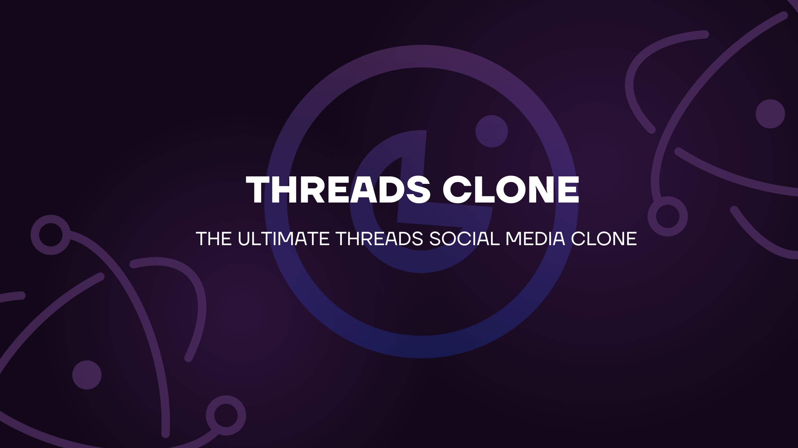

    

## Threads - Threads Clone.

<!-- Add badges here -->

  
  

---

### "Build a Threads Clone With Nextjs, React, MongoDB, Zod, Uploadthing (2023)".

# Key Features:

- 🌐 Next.js 14 & server actions
- 🎨 Beautiful component system using Shadcn UI
- 🔐 Auth using Clerk
- 📝 Learn MongoDB handling of complex schemas, multiple data population
- 🌓 Light and Dark mode
- 🔗 Real-time database
- 🚪 Listen to real-time events with webhooks
- 🔄 Infinite children documents
- 🗑️ Trash can & soft delete 
- 🗺 File upload using Uploadthing
- 🛍 Understand middleware, API actions, and authorization
- 💳 File replacement
- 🏠 Landing page
- 📊 Validate data with Zod
- 🌧 Explore & integrate new Next.js layout route groups
- 💾 Manage forms with react hook form
- 🚀 Deployment on Vercel
- 📱 Mobile responsiveness
- 🌐 Build a solid application architecture
- ↕️ Fully collapsable sidebar
- 🖼️ Cover image of each document 
